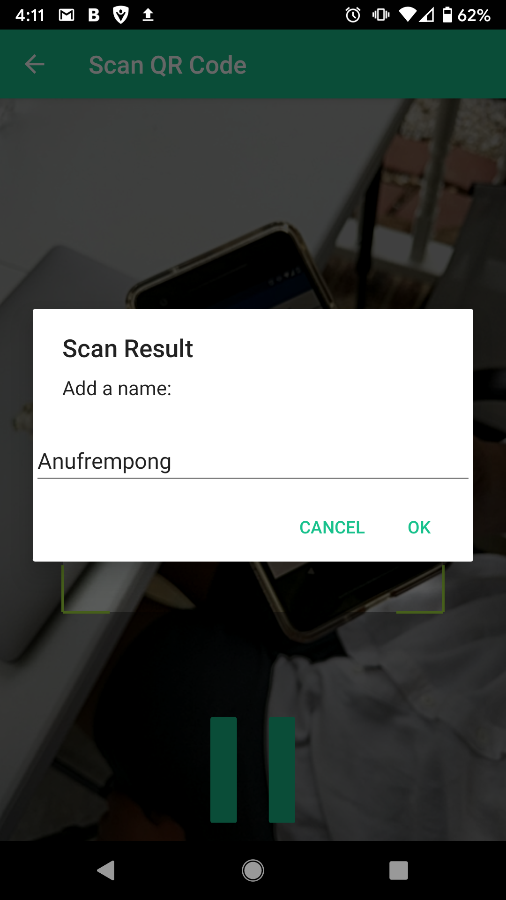

# QRecruiter
#### QRecruiter allows users to collect and organize large lists of LinkedIn profiles while eliminating the need to add each individual candidate to their personal LinkedIn network.
  - create/rename/sort/delete events
  - create/rename/sort/delete/favorite profiles
  - export data to csv
  
#### QRecruiter is available for download on Android devices: [Google Play Store](https://play.google.com/store/apps/details?id=com.yfrempon.qrecruiter)
   
#### App demo: [YouTube](https://www.youtube.com/watch?v=ozDY7Fv5bb0)

#### Source code directory: [app/src/main/java/com/yfrempon/qrecruiter/](https://github.com/YawFrempong/QRecruiter/tree/master/app/src/main/java/com/yfrempon/qrecruiter)

#### Screenshots:
      

Enjoy !!!
~ Yaw
